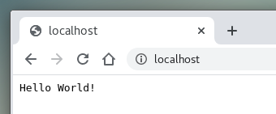

## setup
### clone original git repository
```
[fli@192-168-1-10 ~]$ git clone https://github.com/rea-cruitment/simple-sinatra-app.git
Cloning into 'simple-sinatra-app'...
remote: Enumerating objects: 37, done.
remote: Total 37 (delta 0), reused 0 (delta 0), pack-reused 37
Unpacking objects: 100% (37/37), done.
[fli@192-168-1-10 ~]$

[fli@192-168-1-10 ~]$ cd simple-sinatra-app/
[fli@192-168-1-10 simple-sinatra-app]$ 

[fli@192-168-1-10 simple-sinatra-app]$ ll -a
total 24
drwxrwxr-x.  3 fli fli  106 Feb 10 15:26 .
drwx-----x. 55 fli fli 4096 Feb 10 15:26 ..
-rw-rw-r--.  1 fli fli   50 Feb 10 15:26 config.ru
-rw-rw-r--.  1 fli fli   43 Feb 10 15:26 Gemfile
drwxrwxr-x.  8 fli fli  163 Feb 10 15:26 .git
-rw-rw-r--.  1 fli fli   18 Feb 10 15:26 .gitignore
-rw-rw-r--.  1 fli fli   50 Feb 10 15:26 helloworld.rb
-rw-rw-r--.  1 fli fli 2058 Feb 10 15:26 README.md
[fli@192-168-1-10 simple-sinatra-app]$ 
```

### create new repository `simple-sinatra-app` in `fen9li` account 
```
[fli@192-168-1-10 simple-sinatra-app]$ git remote set-url origin git@github.com:fen9li/simple-sinatra-app.git
[fli@192-168-1-10 simple-sinatra-app]$ git remote -v
origin  git@github.com:fen9li/simple-sinatra-app.git (fetch)
origin  git@github.com:fen9li/simple-sinatra-app.git (push)
[fli@192-168-1-10 simple-sinatra-app]$ git status
On branch master
Your branch is up to date with 'origin/master'.

nothing to commit, working tree clean
[fli@192-168-1-10 simple-sinatra-app]$ git checkout -b develop
Switched to a new branch 'develop'
[fli@192-168-1-10 simple-sinatra-app]$ git push --set-upstream origin develop
The authenticity of host 'github.com (52.64.108.95)' can't be established.
RSA key fingerprint is SHA256:nThbg6kXUpJWGl7E1IGOCspRomTxdCARLviKw6E5SY8.
RSA key fingerprint is MD5:16:27:ac:a5:76:28:2d:36:63:1b:56:4d:eb:df:a6:48.
Are you sure you want to continue connecting (yes/no)? yes
Warning: Permanently added 'github.com,52.64.108.95' (RSA) to the list of known hosts.
Enumerating objects: 37, done.
Counting objects: 100% (37/37), done.
Delta compression using up to 8 threads
Compressing objects: 100% (33/33), done.
Writing objects: 100% (37/37), 5.08 KiB | 578.00 KiB/s, done.
Total 37 (delta 16), reused 0 (delta 0)
remote: Resolving deltas: 100% (16/16), done.
To github.com:fen9li/simple-sinatra-app.git
 * [new branch]      develop -> develop
Branch 'develop' set up to track remote branch 'develop' from 'origin'.
[fli@192-168-1-10 simple-sinatra-app]$ 
```

## create `Dockerfile`
```
[fli@192-168-1-10 simple-sinatra-app]$ cat Dockerfile
FROM ruby:2.7.0-slim

RUN apt-get update -qq && apt-get install -y build-essential

ENV APP_HOME /app
RUN mkdir $APP_HOME
WORKDIR $APP_HOME

ADD Gemfile* $APP_HOME/
RUN bundle config set without 'development test'
RUN bundle install

ADD . $APP_HOME

EXPOSE 9292

CMD ["bundle", "exec", "rackup", "--host", "0.0.0.0", "-p", "9292"]
[fli@192-168-1-10 simple-sinatra-app]$ 
```

## build docker image `sinatra-test:v1.0.0` and run it

```
docker build --no-cache -t sinatra-test:v1.0.0 .

[fli@192-168-1-10 simple-sinatra-app]$ docker run -d --rm --name sinatra -p 80:9292 sinatra-test:v1.0.0
726ec1a3bf86c03bd36f3b66f9cb5842ac36ecb71e8ced2b960c22bed36920fa
[fli@192-168-1-10 simple-sinatra-app]$ docker container ls
CONTAINER ID        IMAGE                 COMMAND                  CREATED             STATUS              PORTS                  NAMES
726ec1a3bf86        sinatra-test:v1.0.0   "bundle exec rackup …"   12 seconds ago      Up 10 seconds       0.0.0.0:80->9292/tcp   sinatra
[fli@192-168-1-10 simple-sinatra-app]$ docker port 726
9292/tcp -> 0.0.0.0:80
[fli@192-168-1-10 simple-sinatra-app]$ curl localhost
Hello World![fli@192-168-1-10 simple-sinatra-app]$ docker logs 726
[2020-02-12 03:39:30] INFO  WEBrick 1.6.0
[2020-02-12 03:39:30] INFO  ruby 2.7.0 (2019-12-25) [x86_64-linux]
[2020-02-12 03:39:30] INFO  WEBrick::HTTPServer#start: pid=1 port=9292
172.17.0.1 - - [12/Feb/2020:03:39:57 +0000] "GET / HTTP/1.1" 200 12 0.0346
[fli@192-168-1-10 simple-sinatra-app]$  
```

## The running result screenshot



